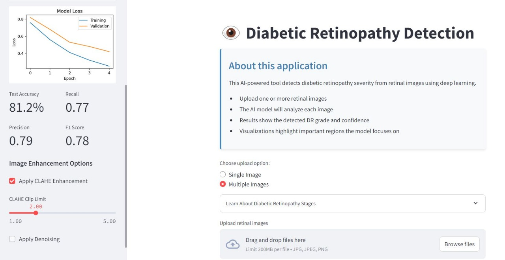
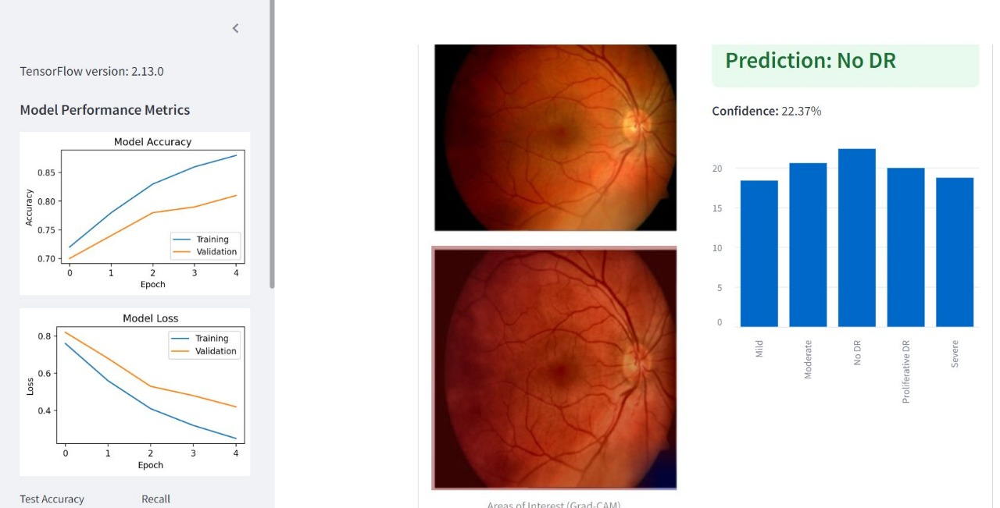

# 👁️ Diabetic Retinopathy Detection App

A powerful and user-friendly **web application** that detects the severity of **diabetic retinopathy (DR)** from retinal images using **deep learning** and **Grad-CAM explainability** — built with **Streamlit**.

> 🧠 Built with TensorFlow, EfficientNet, and Streamlit

## 🩺 What is Diabetic Retinopathy?

Diabetic retinopathy (DR) is a complication of diabetes that affects the eyes. Early detection through retinal scans can prevent severe vision loss. This app helps classify DR into 5 stages using AI.

## 📁 Project Structure

Diabetic-Retionpathy-Detection/
├── app_n.py # Main Streamlit app
├── DR_detection_model.h5 # Pretrained model (download separately)
├── best_model.h5 # Optional legacy model
├── Frontpage.jpg # App frontpage screenshot
├── Resultpage.jpg # App result screenshot
├── README.md # Project description
├── LICENSE # MIT License

## 🚀 Features

- Upload **single** or **multiple** retinal images
- Detect DR stages:
  - No DR
  - Mild
  - Moderate
  - Severe
  - Proliferative DR
- Display **prediction confidence** and **bar charts**
- **Grad-CAM visualizations** to highlight model attention regions
- Batch processing support
- Download results as **CSV**
- Image quality checks: brightness, contrast, resolution

## 🧠 Model & Tech Stack

| Component     | Tech Used                    |
| ------------- | ---------------------------- |
| Model         | TensorFlow + EfficientNetB0  |
| Frontend UI   | Streamlit                    |
| Visualization | Grad-CAM (Heatmap Attention) |
| Preprocessing | OpenCV (CLAHE, denoising)    |
| Deployment    | Local run via Streamlit      |

## 🧪 DR Stage Classification

| Stage                    | Description                                  |
| ------------------------ | -------------------------------------------- |
| **0 - No DR**            | No visible damage                            |
| **1 - Mild**             | Few microaneurysms                           |
| **2 - Moderate**         | Vessel blockages                             |
| **3 - Severe**           | Severe blockages, new vessel growth          |
| **4 - Proliferative DR** | Fragile vessel bleeding, risk of vision loss |

## 📸 Screenshot

## Front Page -

## Result Page -

## 📦 Installation

### 1. Clone this Repository

git clone https://github.com/Sriyasnehasis/Diabetic-Retionpathy-Detection.git
cd Diabetic-Retionpathy-Detection

### 2. Install Required Packages

pip install -r requirements.txt
✅ Recommended: Use a virtual environment.

### 🔍 Running the App

streamlit run app_n.py

## 📜 License

This project is licensed under the [MIT License](LICENSE).
